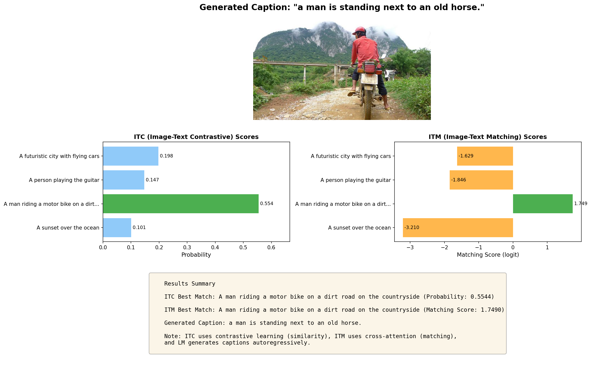

# BLIP from Scratch

A PyTorch implementation of BLIP (Bootstrapping Language-Image Pre-training) built from scratch for image-text understanding and caption generation.

## 🌟 Overview

This project implements the BLIP model, a vision-language model that unifies understanding and generation tasks. The model is trained on the MS COCO dataset and supports three key modes:

- **ITC (Image-Text Contrastive)**: Learns aligned representations of images and text
- **ITM (Image-Text Matching)**: Determines if an image-text pair matches
- **LM (Language Modeling)**: Generates captions for images

**Note**: This is a simplified re-implementation of the BLIP architecture focusing on the core model components. The "bootstrapping" mechanism (CapFilt) from the original paper, which filters and generates synthetic captions to improve dataset quality, is not implemented in this version.

## 🚀 Features

- ✅ Complete BLIP architecture implementation from scratch
- ✅ Multi-task learning with ITC, ITM, and LM objectives
- ✅ Vision Transformer (ViT) for image encoding
- ✅ BERT-based text encoder/decoder with cross-attention
- ✅ Weight sharing between encoder and decoder components
- ✅ Probabilistic negative sampling for ITM training
- ✅ Autoregressive caption generation with repetition penalty
- ✅ Early stopping and validation monitoring
- ✅ Hyperparameter tuning with Optuna

## 🏗️ Architecture

### Model Components

```
BLIP Model
├── Image Encoder (Vision Transformer)
│   ├── ViT Base (patch16, 224x224)
│   └── Vision projection (768 → 256)
│
└── Text Encoder/Decoder (BERT-based)
    ├── Base BERT (for ITC)
    ├── ITM BERT (with cross-attention)
    ├── Text Decoder (with cross-attention)
    ├── Text projection (768 → 256)
    ├── ITM head (768 → 2)
    └── LM head (768 → vocab_size)
```

### Training Objectives

1. **ITC Loss**: Contrastive learning between image and text embeddings
2. **ITM Loss**: Binary classification for image-text matching
3. **LM Loss**: Next-token prediction for caption generation

## 🎯 Usage

### Training

Train the model on MS COCO dataset:

```bash
uv run python train.py
```

**Training Parameters:**
- Max steps: 30,000
- Batch size: 16
- Learning rate: 1e-5
- Weight decay: 0.05
- Validation interval: 200 steps
- Early stopping patience: 3

The best model will be saved as `best_blip_model.pth`.

### Inference

Run inference using the trained model:

```bash
uv run python infer.py
```

This will demonstrate all three inference modes:

#### 1. ITC Mode (Image-Text Contrastive)
```python
from infer import inference

text_candidates = [
    "A sunset over the ocean",
    "A man petting a dog",
    "A person riding a bicycle",
    "A futuristic city with flying cars",
]

probs = inference("best_blip_model.pth", "image.jpg", text_candidates, mode="itc")
```

#### 2. ITM Mode (Image-Text Matching)
```python
probs = inference("best_blip_model.pth", "image.jpg", text_candidates, mode="itm")
```

#### 3. LM Mode (Caption Generation)
```python
caption = inference("best_blip_model.pth", "image.jpg", [], mode="lm")
print(f"Generated caption: {caption}")
```

### Caption Generation with Custom Parameters

```python
from infer import load_model, generate_caption
from transformers import BertTokenizer

device = torch.device("cuda" if torch.cuda.is_available() else "cpu")
model = load_model("best_blip_model.pth", device)
tokenizer = BertTokenizer.from_pretrained("bert-base-uncased")

# Generate caption with custom parameters
caption = generate_caption(
    model,
    image_tensor,
    tokenizer,
    device,
    max_length=30,
    use_sampling=False,      # True for probabilistic sampling
    temperature=1.0,         # Controls randomness (when sampling)
    repetition_penalty=1.5   # Reduces repetition (>1.0)
)
```

### Hyperparameter Tuning

Optimize hyperparameters using Optuna:

```bash
uv run python tune_hyperparams.py
```

This will search for optimal:
- Learning rate
- Weight decay

### 🎨 Visual Results

Generate visual inference results showing all three modes (ITC, ITM, LM) in one image:

```bash
uv run python visualize_results.py
```

This creates `inference_result.png` with:
- **Original image** with generated caption
- **ITC scores** (contrastive similarity probabilities)
- **ITM scores** (matching logits with cross-attention)
- **Best matches** summary for each mode

**Example output:**


The visualization helps compare how different BLIP objectives evaluate the same image-text pairs.

## 📁 Project Structure

```
BLIP-from-scratch/
├── blip.py                    # Main BLIP model
├── image_encoder.py           # ViT-based image encoder
├── text_encoder_decoder.py   # BERT-based text encoder/decoder
├── train.py                   # Training script
├── infer.py                   # Inference script
├── visualize_results.py       # Visual inference results generator
├── dataloader.py              # Data loading utilities
├── tune_hyperparams.py        # Hyperparameter tuning
├── check_ms_coco_captions_data.py  # Dataset verification
├── best_blip_model.pth        # Trained model checkpoint
├── inference_result.png       # Example visualization output
├── pyproject.toml             # Project dependencies
└── README.md                  # This file
```

## 🔬 Technical Details

### Weight Sharing Strategy

The model uses efficient weight sharing:
- Embeddings are shared across all BERT variants
- Self-attention and feed-forward layers are shared
- Cross-attention layers are independent for ITM and decoder

### HuggingFace BERT Configuration

When using HuggingFace's BERT implementation, enabling cross-attention requires specific configuration:
- `add_cross_attention=True` requires `is_decoder=True` to be set
- This constraint applies to both ITM (Image-Text Matching) and LM (Language Modeling) modes

**Implementation Solution:**

To handle this constraint while maintaining the BLIP architecture, we implemented:

1. **Three Separate BERT Instances:**
   ```python
   # ITC: Standard encoder without cross-attention
   self.base_bert = BertModel.from_pretrained(model_name)
   
   # ITM & LM: Decoder with cross-attention enabled
   common_config = BertConfig.from_pretrained(model_name)
   common_config.add_cross_attention = True
   common_config.is_decoder = True
   self.itm_bert = BertModel.from_pretrained(model_name, config=common_config)
   self.text_decoder = BertModel.from_pretrained(model_name, config=common_config)
   ```

2. **Manual Weight Sharing via `_share_weights()` method:**
   - **Shared across all models:** Embeddings layer
   - **Shared between base_bert and itm_bert/decoder:** Self-attention, intermediate, and output layers
   - **Independent:** Cross-attention layers (required for ITM and LM tasks)
   - **Shared between ITM and decoder:** Cross-attention layers (for parameter efficiency)

This design allows the model to:
- Use cross-attention for multimodal fusion in ITM and LM tasks
- Maintain efficient parameter sharing while respecting HuggingFace's architecture constraints
- Keep the ITC encoder lightweight without decoder overhead
- Satisfy HuggingFace's requirement that `is_decoder=True` when using cross-attention

### Negative Sampling for ITM

The ITM (Image-Text Matching) task requires both positive and negative pairs to learn discrimination. This implementation uses **hard negative mining** based on ITC similarity scores.

**Why Hard Negatives Matter:**
- Random negatives are too easy (model learns trivial patterns)
- Hard negatives (high ITC similarity but incorrect matches) force the model to learn fine-grained differences
- ITM uses cross-attention for deeper multimodal fusion, while ITC only compares embeddings

**Implementation Strategy:**

1. **Compute ITC Similarity Matrix:**
   ```python
   # Get similarity scores between all image-text pairs in batch
   sim_i2t, sim_t2i = model(images, input_ids, attention_mask, mode="itc")
   # sim_i2t shape: [batch_size, batch_size]
   ```

2. **Create Probability Distribution for Sampling:**
   ```python
   # Convert similarities to probabilities
   weights_i2t = F.softmax(sim_i2t[:, :batch_size], dim=1) + 1e-4
   weights_i2t.fill_diagonal_(0)  # Don't sample the correct match
   ```
   - Higher ITC similarity → Higher sampling probability
   - Diagonal is zeroed to prevent sampling the positive pair

3. **Probabilistic Sampling of Hard Negatives:**
   ```python
   # For each image, sample one negative text based on ITC similarity
   for b in range(batch_size):
       neg_idx = torch.multinomial(weights_i2t[b], 1).item()
       text_neg_indices.append(neg_idx)
   ```
   - Uses `torch.multinomial` for weighted random sampling
   - Each image gets a different negative text

4. **Construct ITM Training Batch:**
   ```python
   # Positive pairs: (image_i, text_i) → label = 1
   itm_output_pos = model(images, input_ids, attention_mask, mode="itm")
   
   # Negative pairs: (image_i, text_j where j≠i) → label = 0
   itm_output_neg = model(images, input_ids_neg, attn_mask_neg, mode="itm")
   
   # Combine with 1:1 ratio
   itm_logits = torch.cat([itm_output_pos, itm_output_neg], dim=0)
   itm_labels = torch.cat([ones, zeros], dim=0)  # [1,1,1..., 0,0,0...]
   ```

**Key Design Decisions:**
- **1:1 Ratio:** Equal positive and negative samples for balanced learning
- **ITC-guided sampling:** Leverages contrastive learning results to find hard cases
- **Per-batch diversity:** Each batch has different hard negatives based on that batch's ITC scores
- **Cross-attention fusion:** ITM goes deeper than ITC by fusing image-text with cross-attention layers

### Data Preprocessing

**Training:**
- Random resized crop (224x224, scale 0.8-1.0)
- Random horizontal flip (p=0.5)
- ImageNet normalization

**Validation/Inference:**
- Center resize (224x224)
- ImageNet normalization

## 📊 Dataset

The model is trained on **MS COCO Captions** dataset:
- Training samples: 414,113 image-caption pairs
- Validation samples: 202,520 image-caption pairs
- Accessed via HuggingFace: `jxie/coco_captions`

## 🔍 Model Evaluation

Monitor these metrics during training:
- Total validation loss
- ITC loss (contrastive learning quality)
- ITM loss (matching accuracy)
- LM loss (caption generation quality)
- ITM accuracy (positive and negative separately)

## 📝 Citation

Original BLIP paper:
```bibtex
@inproceedings{li2022blip,
    title={BLIP: Bootstrapping Language-Image Pre-training for Unified Vision-Language Understanding and Generation}, 
    author={Junnan Li and Dongxu Li and Caiming Xiong and Steven Hoi},
    year={2022},
    booktitle={ICML},
}
```
